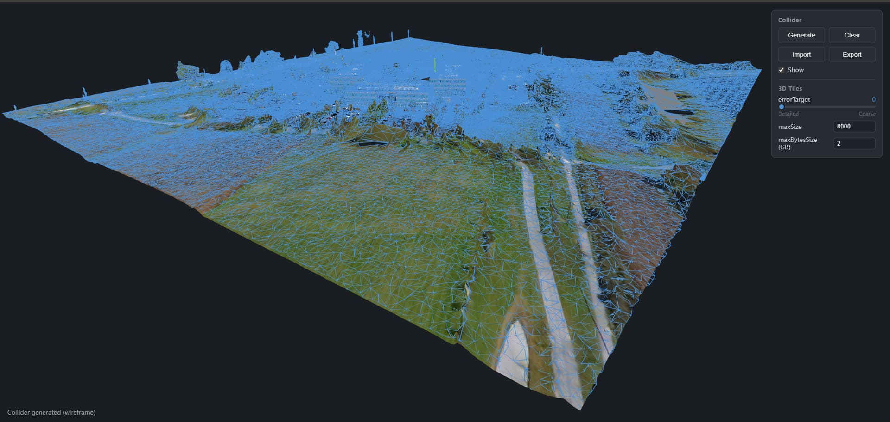

# collider-forge

Language: [中文](./README.md) | [English](./README.en.md)

Visual tool for loading glTF and 3D Tiles, generating collision meshes, and exporting collider `.glb` files.



## Features

- Load local `.glb` / `.gltf` models.
- Load remote glTF / GLB URLs.
- Load 3D Tiles tilesets from URL.
- Load Google 3D Tiles through Cesium Ion.
- Generate a merged trimesh collider from visible model geometry.
- Import an existing collider `.glb`.
- Export collider `.glb` with optional Draco compression.
- Choose export up axis for Cesium-style Z-up or glTF / three.js Y-up workflows.

## Development

```bash
npm install
npm run dev
```

The Vite dev server runs on port `5174` by default.

## Loading Models

Local file loading is intended for `.glb` / `.gltf` assets. A `.gltf` file that depends on external `.bin` or texture files may not load correctly from a single file picker selection.

3D Tiles are service or URL based. Use the URL loader or Cesium Ion loader for 3D Tiles rather than the local file picker.

## Third-Party Runtime Files

This repository includes several third-party JavaScript and WebAssembly runtime files under `public/libs` for model decoding, texture transcoding, and Draco export support.

See [THIRD_PARTY_NOTICES.md](./THIRD_PARTY_NOTICES.md) for details.
