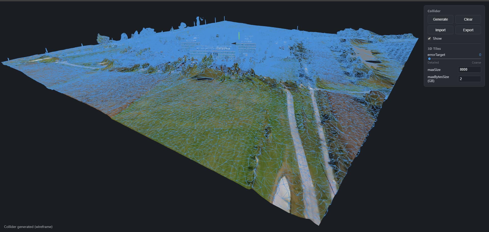

# collider-forge

简体中文 | [English](README_En.md)

一个用于加载 glTF、3D Tiles 与 Gaussian Splat / 点云、生成碰撞网格并导出 collider `.glb` 的可视化工具。



## 快速开始

当前预编译版本仅支持 Windows x64。

1. 下载并解压 [collider-forge v0.1.0](https://github.com/hh-hang/collider-forge/archive/refs/tags/v0.1.0.zip)。
2. 在解压后的项目目录中运行：

   ```bash
   npm install
   npm run dev
   ```

3. 打开浏览器访问 http://localhost:5174。

## 功能

- 加载本地 `.glb` / `.gltf` 模型。
- 加载远程 glTF / GLB URL。
- 通过 URL 加载 3D Tiles tileset。
- 通过 Cesium Ion 加载 Google 3D Tiles。
- 从模型几何生成合并后的 trimesh 碰撞体。
- 使用 Spark 预览本地或远程 `.ply`、`.spz`、`.splat`、`.ksplat` 和打包版 `.sog`。
- 从 Spark 解码结果中提取点坐标，并通过可调 Poisson depth 重建碰撞体。
- 导入已有 collider `.glb`。
- 导出 collider `.glb`，可选 Draco 压缩。
- 导出时可选择 Cesium 常用的 Z-up，或 glTF / three.js 常用的 Y-up。

> 当前仅支持单文件的打包版 `.sog`；由 `meta.json` 和多个 WebP 文件组成的非打包 SOG 暂不支持。

## 致谢

[three.js](https://github.com/mrdoob/three.js)

[3d-tiles-renderer](https://github.com/NASA-AMMOS/3D-Tiles-Renderer-ThreeJS)

[Spark](https://github.com/sparkjsdev/spark)

[Open3D](https://github.com/isl-org/Open3D)

[draco](https://github.com/google/draco)

> 本仓库 `public/libs` 下的第三方运行时文件许可声明详见 [THIRD_PARTY_NOTICES.md](./THIRD_PARTY_NOTICES.md)。
